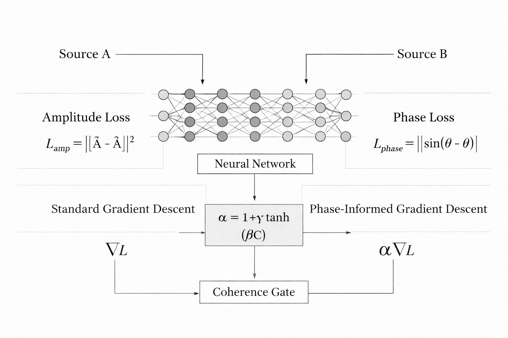
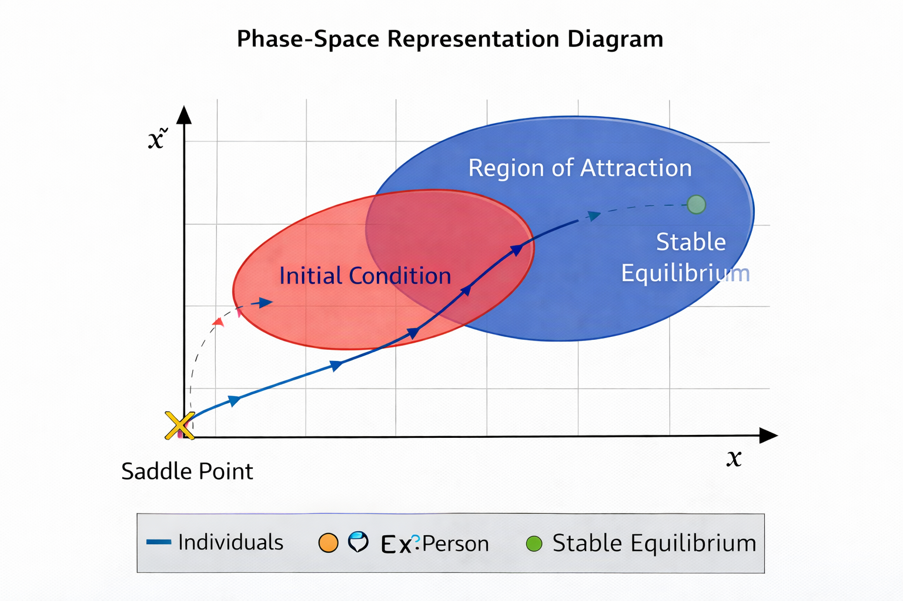
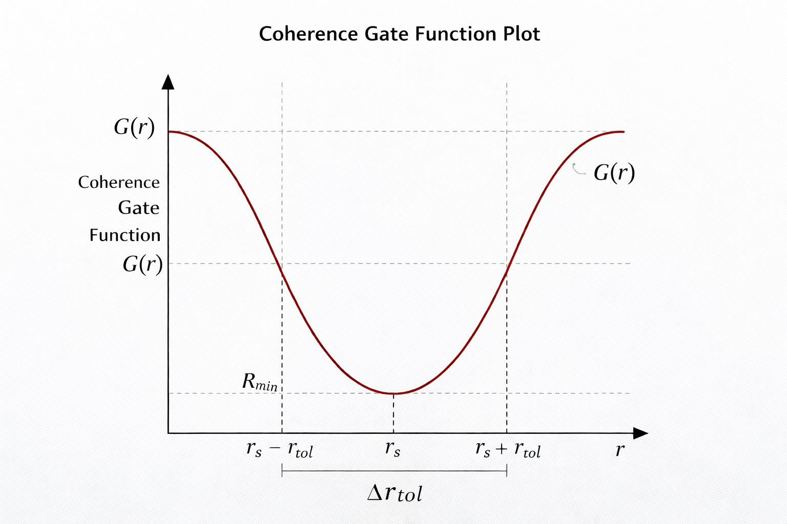
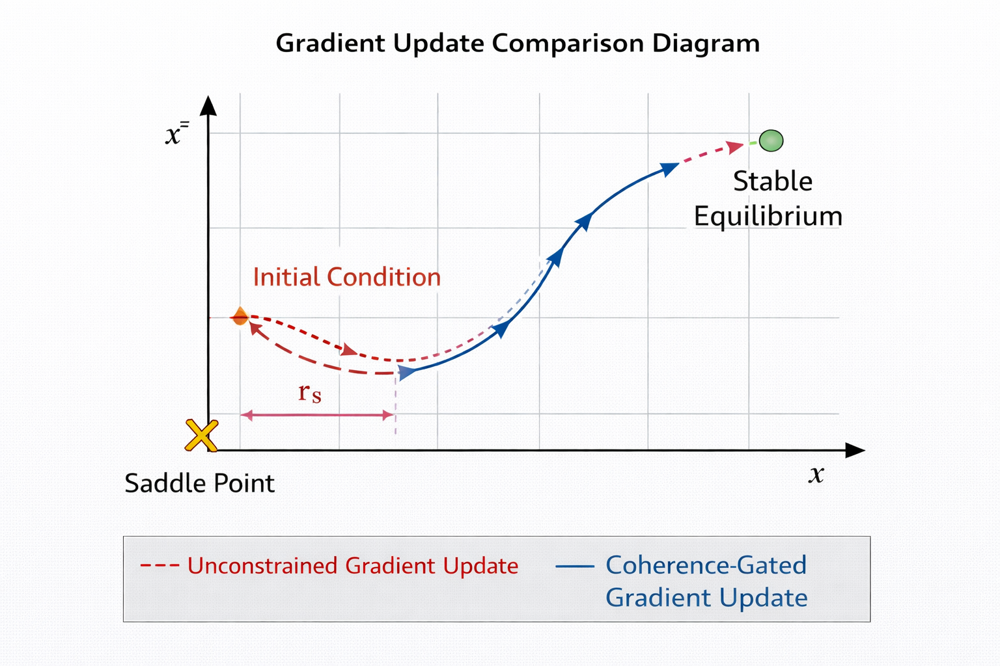
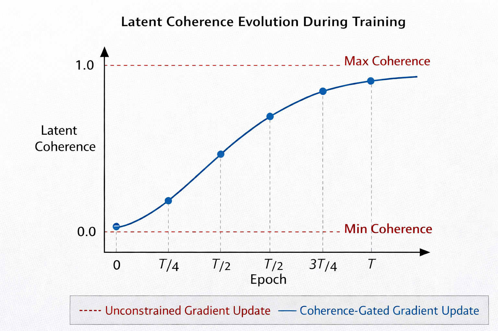
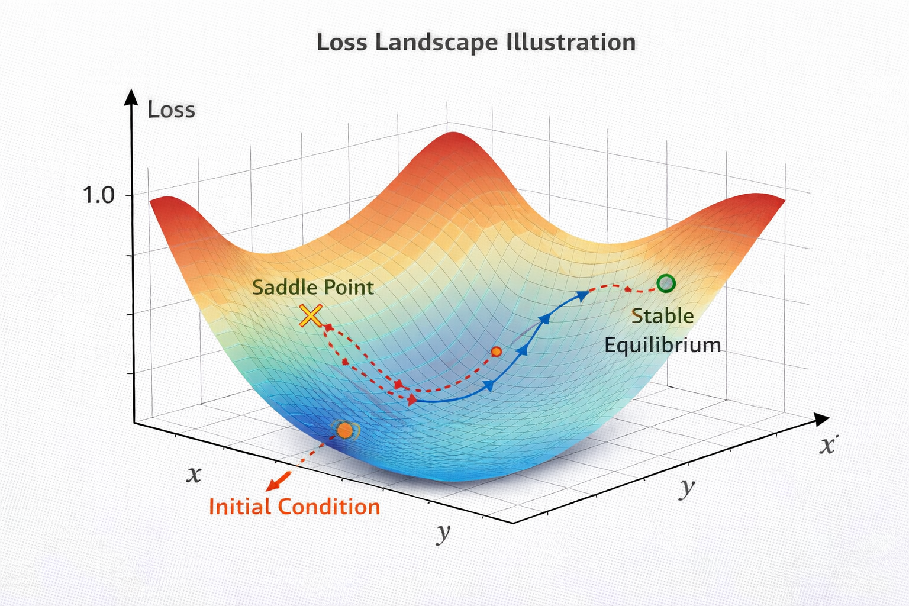
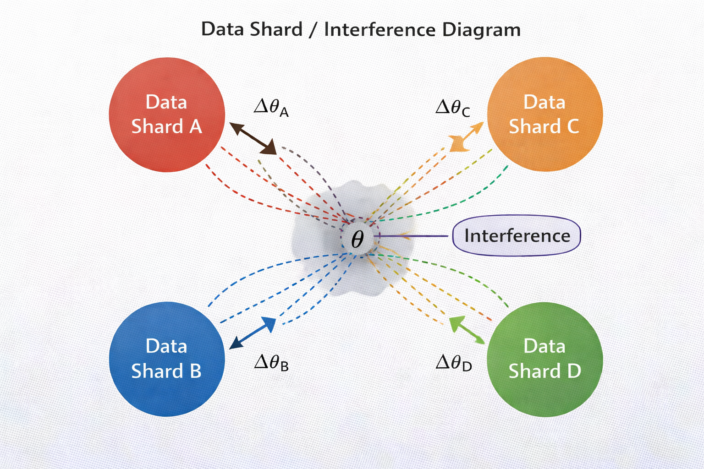

# Phase-Induced Coherence-Gated Gradient Descent

Research prototype for testing whether phase coherence between latent representations can improve supervised learning.

This repo compares standard training against variants that:
- represent latent features as complex signals
- align latent amplitude and phase to a paired reference
- scale per-sample classification loss by a coherence-derived gate



<a target="_blank" href="https://colab.research.google.com/github/jzgdev/phase-induced-coherence-gated-gradient-descent">
  
</a>


## Overview

The canonical runner is [phase_coherence_test.py](phase_coherence_test.py). It supports:
- synthetic paired-view experiments
- MedleyDB sample same-track segment learning
- FMA-small same-track paired-segment classification
- seed-matched ablations
- checkpoint saving
- structured JSON and JSONL results
- optional reviewer-facing plots

The older [phase_coherence_test_instrumented.py](phase_coherence_test_instrumented.py) is kept for comparison and development history, but it is not the main entrypoint.

## Method

Each latent component is treated as a complex signal:

$$
h_i = A_i e^{i\phi_i}
$$

with model and reference signals:

$$
\psi_\theta(x) = A_\theta(x)e^{i\phi_\theta(x)}, \quad
\psi_r(x) = A_r(x)e^{i\phi_r(x)}
$$

The coherence score is:

$$
C(x) = \frac{1}{n}\sum_i |h_i||r_i|\cos(\phi_i - \phi_{r,i})
$$

and the gated update is:

$$
g' = \alpha(x) g, \qquad \alpha(x) = \sigma(\beta C(x))
$$

The implementation uses a centered, bounded gate during training so gating remains mild rather than unstable.

## Datasets

### Synthetic

- Each item returns `(x, x_ref, y)`.
- In the default `paired_view` mode, `x` and `x_ref` share the same class template and base phase, but use independent amplitude jitter and noise.
- `self` mode is still available for diagnostics, but it is not the default because it makes alignment too easy.

### MedleyDB Sample

- Each item returns a mix segment, an aligned stem segment, and the track label.
- Audio is cached in RAM to reduce repeated disk I/O.
- Validation uses a fixed deterministic schedule.
- Training uses an epoch-indexed deterministic schedule so all variants see the same sample order for a given seed and epoch.

Current claim boundary:
- MedleyDB results in this repo measure same-track segment classification and learning.
- The repo does not currently test held-out track or artist generalization.

### FMA-Small

- Each item returns two segments from the same FMA track plus the official top-genre label.
- Splits and labels are read from `fma_metadata/tracks.csv`.
- Since FMA-small has no aligned stems, the paired reference is a second segment from the same track.
- Validation uses the official `validation` split.
- Mixed sample rates are resampled on load, and unreadable MP3s are skipped during caching.

## Variants

| Variant | Description |
| --- | --- |
| `baseline` | Standard real-valued encoder and classifier |
| `complex` | Complex latent representation without alignment or gating |
| `align` | Complex latent representation with amplitude and phase alignment losses |
| `gate_only` | Complex latent representation with coherence-gated cross-entropy only |
| `full` | Alignment losses plus coherence-gated cross-entropy |

For fairness, all phase-based variants start each run from the same initial weights.

## Metrics And Outputs

Per epoch, the runner logs:
- `train_loss`
- `train_coherence`
- `mean_gate`
- `amp_align_loss`
- `phase_align_loss`
- `val_loss`
- `val_acc`
- `val_coherence`
- `epoch_time_sec`

The reviewer-facing analysis path also logs step-level metrics and supports:
- `steps_to_loss_target`
- gradient-norm variance `Var(||g||)`
- train/validation generalization gap
- loss-vs-step stability plots

Results are written under:

```text
results/<dataset>/<eval_protocol>/seed_<seed>/
```

Typical files include:
- `config.json`
- `<variant>_steps.jsonl`
- `<variant>_epochs.jsonl`
- `run_summary.json`

Cross-run aggregation is written to:

```text
results/<dataset>/<eval_protocol>/summary.json
```

Optional checkpoints are written to:

```text
checkpoints/baseline_best.pt
checkpoints/complex_best.pt
checkpoints/align_best.pt
checkpoints/gate_only_best.pt
checkpoints/full_best.pt
```

Hugging Face model repo:
- [jzgdev/phase-induced-coherence-gated-gradient-descent](https://huggingface.co/jzgdev/phase-induced-coherence-gated-gradient-descent)

## Installation

Requires Python 3.9+.

Minimal setup:

```bash
pip install torch torchaudio soundfile
```

For tests:

```bash
python -m unittest -v
```

## Quick Start

Default synthetic run:

```bash
python phase_coherence_test.py
```

Publication-style synthetic ablation:

```bash
python phase_coherence_test.py \
  --dataset synthetic \
  --variants baseline,complex,align,gate_only,full \
  --analysis_variants baseline,full \
  --num_runs 3 \
  --results_dir results
```

## Dataset Runs

MedleyDB sample:

```bash
python phase_coherence_test.py \
  --dataset medleydb_sample \
  --medleydb_root /path/to/MedleyDB_sample \
  --batch_size 16 \
  --num_workers 4 \
  --eval_protocol same_track_fixed
```

FMA-small:

```bash
python phase_coherence_test.py \
  --dataset fma_small \
  --fma_root /workspace/data/fma/fma_small \
  --fma_metadata_root /workspace/data/fma/fma_metadata \
  --batch_size 16 \
  --num_workers 4 \
  --eval_protocol same_track_fixed
```

Small FMA smoke test:

```bash
python phase_coherence_test.py \
  --dataset fma_small \
  --fma_root /workspace/data/fma/fma_small \
  --fma_metadata_root /workspace/data/fma/fma_metadata \
  --epochs 1 \
  --num_runs 1 \
  --batch_size 8 \
  --num_workers 2 \
  --train_samples_per_epoch 128 \
  --val_samples_per_epoch 64
```

## Useful Flags

- `--variants baseline,complex,align,gate_only,full`
- `--analysis_variants baseline,full`
- `--results_dir PATH`
- `--synthetic_reference_mode self|paired_view`
- `--eval_protocol same_track_fixed`
- `--loss_target 1.0`
- `--step_log_every_n_batches 1`
- `--grad_variance_steps 200`
- `--rolling_window 25`
- `--generate_plots`
- `--fma_root PATH`
- `--fma_metadata_root PATH`
- `--fma_max_tracks N`
- `--save_checkpoints`

If `--generate_plots` is enabled, `matplotlib` must be installed in the runtime where training is executed.

## Colab Notebook

The repo includes a notebook for Colab-based FMA-small runs:
- [PIC_GD_FMA_Small_Colab.ipynb](PIC_GD_FMA_Small_Colab.ipynb)

It covers:
- cloning the repo
- installing runtime dependencies
- downloading FMA-small and metadata
- running a smoke test
- running a full training command

## File Guide

- [phase_coherence_test.py](phase_coherence_test.py): canonical experiment runner
- [phase_coherence_test_instrumented.py](phase_coherence_test_instrumented.py): older instrumentation-heavy runner kept for reference
- [datasets.py](datasets.py): synthetic, MedleyDB sample, and FMA-small dataset code
- [test_phase_coherence.py](test_phase_coherence.py): unit and regression tests for the current pipeline
- `requirements.txt`: environment dependency list that may need curation for a specific machine or container

## Repository Layout

```text
phase-induced-coherence-gated-gradient-descent/
├── phase_coherence_test.py
├── phase_coherence_test_instrumented.py
├── datasets.py
├── test_phase_coherence.py
├── PIC_GD_FMA_Small_Colab.ipynb
├── requirements.txt
└── README.md
```

## Notes

- This is a research prototype, not a production training framework.
- The repo is optimized for fair, seed-matched comparisons across variants.
- Current reporting uses paired per-seed deltas rather than significance testing.

## Additional Images








## License

MIT
